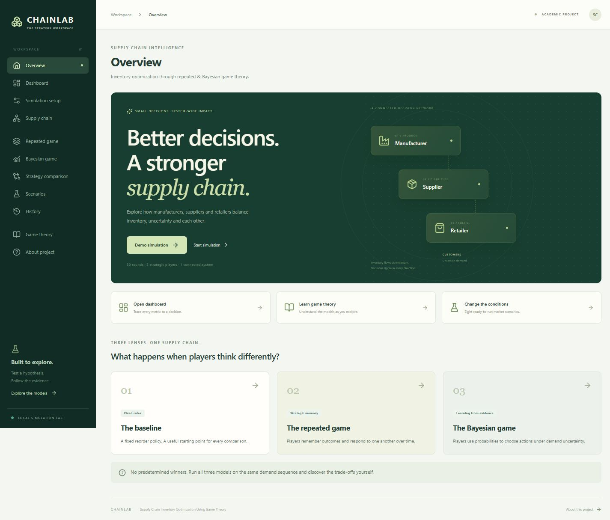
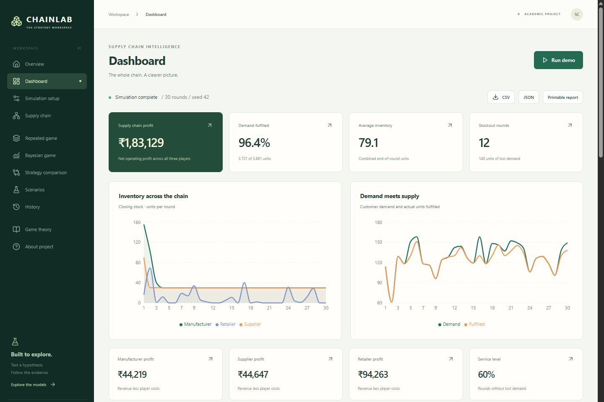

# Supply Chain Inventory Optimization Using Game Theory

**ChainLab** is a college mini project for exploring inventory decisions by a manufacturer, supplier and retailer under uncertain customer demand. Compare a fixed reorder policy with repeated-game coordination and Bayesian expected-utility decisions. Every metric, chart and export comes from the Python simulation.

No paid APIs, cloud account, separate database server or ML training. Works offline after dependencies are installed.

## Screenshots




## What it does

- One-click 30-round demo; configurable 1–100 rounds, costs, inventories, capacity, prices and reproducible seed.
- Normal, Uniform and Poisson demand with hidden LOW/MEDIUM/HIGH regimes, seasons and optional manual observations.
- Three independent player objects with local inventory, profit, memory, forecast and beliefs.
- Baseline, repeated and Bayesian models; conservative, balanced, aggressive and adaptive profiles.
- Tit-for-Tat, Always Cooperate, Always Defect and Adaptive repeated-game mechanisms; configurable discount factor.
- Dashboard with player profits, fulfillment, service level, holding/shortage costs, turnover and eight charts.
- Supply-chain replay, complete round tables, belief curves and per-action expected payoffs.
- Computed two-player payoff matrix and a custom pure Nash-equilibrium solver.
- Identical-demand comparisons, historical comparisons and up to 100 paired experiments per model.
- Eight scenarios, three product presets, bullwhip ratios and educational explanations.
- SQLite history: open, compare, delete and paginate saved runs.
- Round CSV, full JSON, experiment CSV/JSON and a printable report with browser Save as PDF.

## Architecture and folder structure

```text
React / Vite / Tailwind / Recharts / Lucide
                  │ REST /api
FastAPI → NumPy demand + player decisions → SQLAlchemy / SQLite

backend/
  app/
    main.py          API startup, CORS, optional built frontend
    api.py           Run, compare, experiments, history, export
    models.py        Validated request configuration
    simulation.py    Demand, physical flows, aggregate metrics
    players.py       Three players and their shared decision rules
    game_theory.py   Beliefs, expected utility, formulas, Nash
    database.py      One SQLite result table
    scenarios.py     Scenario and product presets
  tests/             Pytest model and API checks
  requirements.txt
frontend/
  src/               App shell, setup, analytics and learning pages
  tests/             Node's built-in API-client tests
data/                 Reproducible demo configuration
docs/                 Model assumptions and demo/testing guide
screenshots/          Captured application screens
```

To keep the project small, each saved run stores its validated configuration and complete result as JSON in one SQLAlchemy table. Separate round/player tables would duplicate data without helping this local demo. There is no authentication, task queue, microservice layer or unnecessary ML.

## Install and run

Prerequisites: Python 3.12+ and Node.js 22.12+ (tested with Python 3.12 and Node 24). Run commands from the repository root unless shown otherwise.

**Backend — Windows PowerShell:**

```powershell
cd backend
python -m venv venv
.\venv\Scripts\python -m pip install -r requirements.txt
.\venv\Scripts\python -m uvicorn app.main:app --reload --host 127.0.0.1 --port 8000
```

This avoids PowerShell activation-policy issues. Alternatively activate `venv\Scripts\activate` and use `pip` / `uvicorn` directly.

**Backend — macOS / Linux:**

```sh
cd backend
python3 -m venv venv
./venv/bin/python -m pip install -r requirements.txt
./venv/bin/python -m uvicorn app.main:app --reload --host 127.0.0.1 --port 8000
```

**Frontend — second terminal:**

```sh
cd frontend
npm ci
npm run dev
```

Open [the app](http://127.0.0.1:5173), select **Demo simulation**, and inspect the dashboard. The Vite `/api` proxy connects to port 8000. [Interactive API docs](http://127.0.0.1:8000/docs) and [health check](http://127.0.0.1:8000/api/health) are available from FastAPI.

**Single-server classroom demo:** run `npm run build` inside `frontend`, then start/restart FastAPI. Open [port 8000](http://127.0.0.1:8000) to use the built frontend and API together; no Vite process is needed. Build output is intentionally ignored by Git.

The application uses `backend/simulations.db` automatically. Optional environment variables are listed in `backend/.env.example`: `DATABASE_URL` and `CORS_ORIGINS`. Set them in your shell; the example file is documentation and is not loaded automatically. No secrets are required. The server defaults to a local demonstration, not a public multi-user deployment.

## A five-minute demonstration

1. Run the demo; explain the difference between fill rate (units) and service level (rounds).
2. Open **Supply chain**, press Play, and watch inventory and actual shipments change.
3. Open **Repeated game**, run it, and inspect actions, memory and discounted payoff.
4. Open **Bayesian game**, run it, and show Prior → Observation → Posterior.
5. Open **Strategy comparison**, select Run all strategies, and compare profit against stockouts and holding costs.
6. Load a scenario, change one variable, and rerun. Try Experiment mode to avoid conclusions based on one lucky seed.
7. Open **Game theory** for the computed payoff matrix; export results or print a report.

**Product presets:** Everyday essentials, Seasonal apparel and Consumer electronics. Selecting a product starts from defaults and applies its prices/demand/costs. Prices use ₹ for display; the mechanics are generic.

**Scenarios:** Stable demand; sudden demand spike; temporary supply shortage; high holding costs; festival demand; bullwhip effect; low manufacturing capacity; high retail shortage penalty. Loading a scenario resets the setup, so its parameters are visible before running.

## Mathematical models

| Concept | Implementation |
| --- | --- |
| Utility | Revenue − production/purchases − holding − shortage − ordering − transport |
| Stock balance | Ending = beginning + received − shipped/sold |
| Repeated payoff | `V_i = Σ δ^t U_i(t)`, t starts at zero |
| Expected utility | `EU(a) = Σ P(state) × U(a,state)` |
| Bayes update | Posterior ∝ prior × observation likelihood |
| Next prior | `0.8 × posterior + 0.2 × base prior` |
| EOQ | `sqrt(2DS/H)`; consistent period for D and H |
| Safety stock / ROP | `Zσsqrt(L)` / `μL + safety stock` |
| Fill rate | Fulfilled units / demand units |
| Service level | Rounds without lost demand / total rounds |
| Turnover | Horizon COGS / average stock value, both at production cost |
| Bullwhip | Variance of orders / variance of demand |
| Pure Nash | Mutual best responses, including ties |

Repeated play uses transparent memory-based coordination policies. Bayesian players optimize one-period utility over three inventory targets and update beliefs using distribution likelihoods. The displayed Nash matrix is a separate two-player inventory subgame. These are educational models; they do **not** claim a solved full-chain dynamic equilibrium.

Read [the full model notes](docs/MODELS.md) for round timing, state transitions, candidate actions, likelihoods, accounting, approximations and edge cases. Better outcomes are not hard-coded: strategies can lose profit or increase inventory and amplification.

## REST endpoints

| Method | Endpoint | Purpose |
| --- | --- | --- |
| GET | `/api/health` | Health check |
| GET | `/api/defaults` | Complete default configuration and products |
| GET | `/api/scenarios` | Eight presets with parameter patches |
| POST | `/api/simulations` or `/api/simulations/run` | Run and persist |
| POST | `/api/simulations/compare` | Three saved models on identical demand |
| POST | `/api/experiments` | Paired runs; count 2–100, configuration in `config` |
| GET | `/api/experiments/export` | Download deterministic experiment CSV/JSON using the original configuration |
| GET | `/api/simulations?limit=100&offset=0` | History summaries |
| GET | `/api/simulations/{id}` | Full saved JSON result |
| DELETE | `/api/simulations/{id}` | Delete saved run |
| GET | `/api/simulations/{id}/csv` | Round data with player-level columns |
| POST | `/api/game/repeated` | Force repeated model and save |
| POST | `/api/game/bayesian` | Force Bayesian model and save |
| POST | `/api/game/nash` | Find pure equilibria in a payoff matrix |

Most run endpoints accept a configuration object; omitted fields use defaults. Example PowerShell:

```powershell
Invoke-RestMethod -Method Post -Uri http://127.0.0.1:8000/api/simulations/run `
  -ContentType 'application/json' -Body '{"rounds":30,"game_type":"bayesian","seed":42}'
```

Invalid inputs return HTTP 422 with field details; missing simulations return 404. Round counts, experiment counts and matrix sizes are bounded. Negative quantities, nonfinite values, invalid probability sums and excessive initial supplier stock are rejected.

## Checks

```powershell
# From backend (with dependencies installed)
.\venv\Scripts\python -m pytest -q

# From frontend
npm test
npm run build
```

Backend tests cover demand reproducibility, physical and monetary conservation, capacity/storage constraints, inventory formulas, repeated memory/discounting, Bayesian choices and likelihoods, absence of future-demand leakage, Nash equilibria, all scenario presets, API validation, history and CSV. Frontend checks cover request semantics and error visibility. See [the verification and demo checklist](docs/TESTING.md) for browser checks.

## Limitations and future scope

- One product per run; fixed prices; immediate deliveries; lost sales instead of backorders.
- Initial inventory is a sunk asset and has no terminal salvage value.
- Public observations give all Bayesian players the same beliefs. Expected utilities use regime centers and assume candidate orders are fulfilled; realized outcomes can differ.
- Repeated-game incentives are heuristics, not an equilibrium proof. Tit-for-Tat uses a common mechanism for all agents, so a cooperative population stays cooperative.
- EOQ/ROP formulas are reference calculations, not hidden overrides of configuration. Zero denominators show N/A.
- Experiment summaries live in the current browser session; download them to retain results. Individual runs persist in SQLite and can be reopened from History after refresh.
- PDF uses the browser's print dialog. There is no backend PDF service.

Useful future additions, only if needed: shipment lead times, private market signals, real demand calibration and a formally solved dynamic game. Pandas, SciPy and scikit-learn were unnecessary for the implemented calculations.

## Contributors and license

Maintained in [GTDS-MiniProj](https://github.com/Ashproxx/GTDS-MiniProj). Add actual student names and college details before submission; none are invented here. MIT licensed; see [LICENSE](LICENSE).
